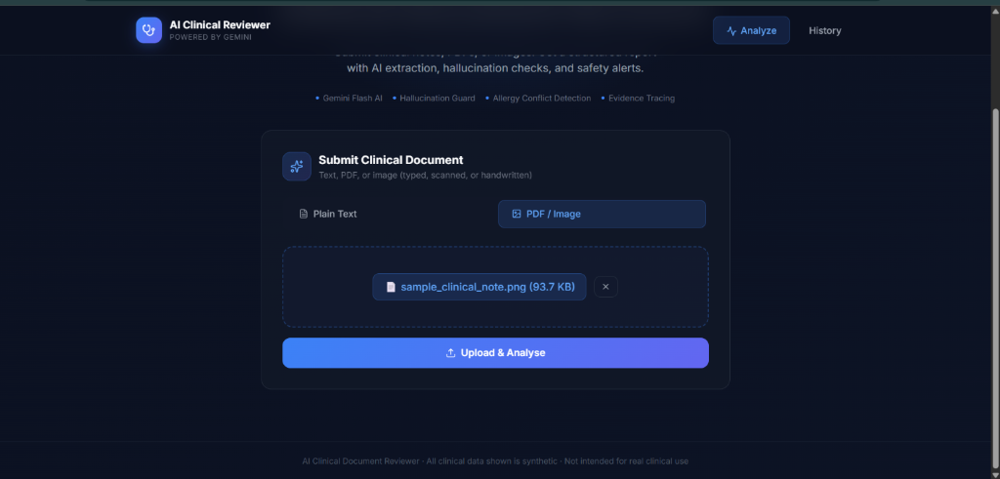
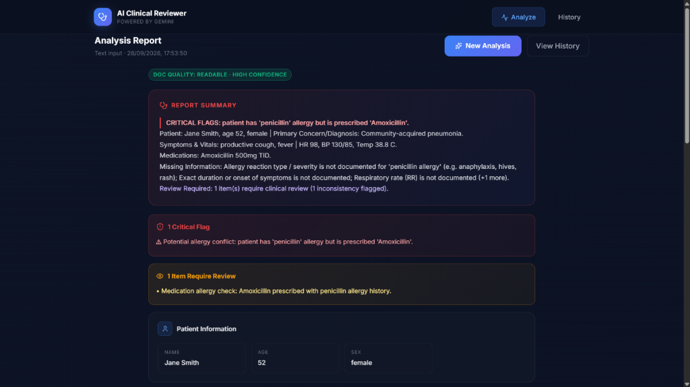
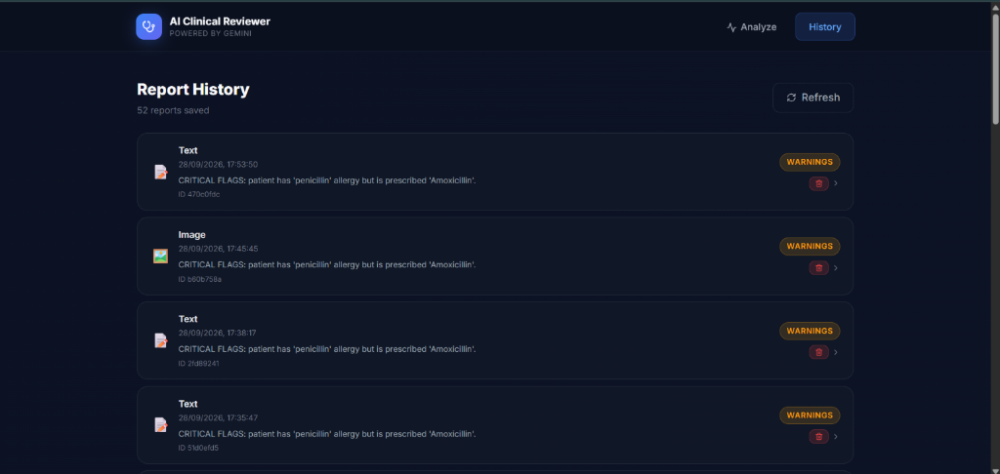

# AI Clinical Document Reviewer

> All documents in this repository are synthetic. This project is not intended for real patient data or clinical decision-making.

AI Clinical Document Reviewer is a full-stack application for submitting a clinical note, image, or PDF and receiving a structured report. The pipeline extracts text, asks Gemini for schema-constrained clinical information, checks that evidence exists in the source, runs deterministic safety rules, and saves the report for later review.

## Features

- Submit plain text, PNG/JPEG/WebP images, searchable PDFs, and scanned PDFs.
- Extract patient information, symptoms, diagnoses, medications, allergies, vitals, observations, missing information, and concerns.
- Attach evidence quotes and confidence levels to extracted items.
- Use rapidfuzz evidence checks to lower confidence and request review when generated evidence cannot be matched to source text.
- Run independent consistency checks for allergy/drug conflicts, implausible vitals, unsupported diagnoses, duplicate medications, and missing fields.
- Generate a deterministic priority summary after all checks.
- Persist reports and expose history, detail, and delete actions.
- Distinguish `completed`, `completed_with_warnings`, `failed`, and `no_clinical_content` results.

## Tech Stack

| Area | Technology |
|---|---|
| Frontend | React 19, TypeScript, Vite 8, Tailwind CSS v4, lucide-react |
| Backend | Python, FastAPI, Pydantic v2, SQLAlchemy |
| Document processing | PyMuPDF, Pillow |
| AI | Google Gemini via `google-genai`; default `MODEL_NAME=gemini-3.5-flash-lite` |
| Evidence matching | rapidfuzz |
| Local database | SQLite |
| Production database option | PostgreSQL, including Neon |
| Deployment configuration | Vercel frontend, Render backend |

## Repository Structure

```text
.
├── backend/
│   ├── app/
│   │   ├── api/routes/       # analyze, health, and reports endpoints
│   │   ├── core/config.py    # environment-backed settings
│   │   ├── db/session.py     # SQLite/PostgreSQL SQLAlchemy setup
│   │   ├── models/report.py  # persisted report row
│   │   ├── schemas/          # Pydantic API and analysis schemas
│   │   └── services/         # processing, Gemini, validation, rules, analysis
│   ├── tests/                # fixtures and endpoint/rule/evidence tests
│   ├── Dockerfile
│   └── requirements.txt
├── docs/                     # architecture, AI/ML design, decisions
├── frontend/
│   ├── src/components/       # form, report view, history, navigation
│   ├── src/api.ts            # fetch client for backend endpoints
│   ├── vercel.json           # SPA fallback rewrite
│   └── package.json
├── samples/                  # synthetic inputs, generated files, evaluation
├── render.yaml
└── README.md
```

## Architecture Overview

The browser sends a text form or file upload to FastAPI. Text PDFs are read with PyMuPDF. If a PDF contains fewer than 50 extracted characters, PyMuPDF renders pages to PNG and Gemini vision transcribes them. Images go directly to Gemini vision. The analyzer validates the structured response, verifies evidence, runs independent rules, creates the summary, determines the status, and stores the result in SQLite or PostgreSQL.

See [docs/architecture.md](docs/architecture.md) for diagrams and the request sequence, and [docs/ai_ml_design.md](docs/ai_ml_design.md) for prompt and validation details.

## Setup

### Prerequisites

- Python 3.12 recommended; Render and the Docker image use Python 3.12.0.
- Node.js 18 or newer.
- A Gemini API key for live analysis.

### Environment Variables

Copy `backend/.env.example` to `backend/.env`. Copy `frontend/.env.example` to `frontend/.env` when using the frontend locally. Never commit either `.env` file.

#### Backend

| Variable | Example/default | Description |
|---|---|---|
| `DATABASE_URL` | `sqlite:///./dev.db` | SQLAlchemy database URL. Use a Neon/PostgreSQL URL for production. |
| `GEMINI_API_KEY` | placeholder | Gemini credential required by `GeminiClient`. |
| `MODEL_NAME` | `gemini-3.5-flash-lite` | Gemini model passed to the SDK for transcription and structured analysis. |
| `CORS_ORIGINS` | `http://localhost:5173,http://localhost:3000` | Comma-separated browser origins accepted by FastAPI CORS. |
| `MAX_UPLOAD_MB` | `10` | Maximum upload size checked by the document processor. |
| `MAX_PDF_PAGES` | `6` | Maximum PDF pages extracted or rendered. |
| `MAX_TEXT_CHARS` | `20000` | Maximum characters accepted in a plain-text analysis request. |
| `RATE_LIMIT_PER_HOUR` | `30` | Maximum `/api/analyze` requests per client IP in one hour. `X-Forwarded-For` is used when present. |
| `LOG_LEVEL` | `INFO` | Python logging level. |

#### Frontend

| Variable | Example/default | Description |
|---|---|---|
| `VITE_API_URL` | empty | Backend base URL in production. Leave empty locally so Vite proxies `/api` to `127.0.0.1:8000`. |

### Run the Backend Locally

```powershell
cd backend
python -m venv .venv
.venv\Scripts\Activate.ps1
pip install -r requirements.txt
Copy-Item .env.example .env
# Edit .env and set GEMINI_API_KEY
uvicorn app.main:app --reload
```

The API runs at `http://127.0.0.1:8000`. OpenAPI documentation is available at `http://127.0.0.1:8000/docs`. The application creates database tables at startup. SQLite needs no separate database server.

### Run the Frontend Locally

```powershell
cd frontend
npm install
Copy-Item .env.example .env
npm run dev
```

The Vite development server runs at `http://localhost:5173` and proxies requests beginning with `/api` to the local backend.

### Database Setup

For local development, keep `DATABASE_URL=sqlite:///./dev.db`. The SQLite file is created under `backend` when the backend runs and is ignored by Git.

For a deployed service, set `DATABASE_URL` to a PostgreSQL connection string from Neon or another PostgreSQL provider. SQLAlchemy selects SQLite connection options only when the URL starts with `sqlite`; otherwise it uses PostgreSQL through `psycopg2-binary`. The application calls `Base.metadata.create_all()` at startup; this project does not include a migration tool.

### Deployment Links

- Frontend: `https://ai-clinical-document-reviewer-self.vercel.app/`
- Backend/API: `https://ai-clinical-document-reviewer.onrender.com`
- Backend health check: `https://ai-clinical-document-reviewer.onrender.com/api/health`
- Backend OpenAPI doc: `https://ai-clinical-document-reviewer.onrender.com/docs`

`render.yaml` configures a Render Python web service rooted at `backend`, and `frontend/vercel.json` rewrites frontend routes to `index.html` for SPA refreshes.

## API Endpoints

| Method | Endpoint | Purpose |
|---|---|---|
| `GET` | `/api/health` | Return `{ "status": "ok" }`. |
| `POST` | `/api/analyze` | Analyze multipart `text` or `file` input. |
| `GET` | `/api/reports` | List saved reports, newest first. |
| `GET` | `/api/reports/{report_id}` | Return one full report. |
| `DELETE` | `/api/reports/{report_id}` | Delete one report. |

Example requests:

```powershell
# Text analysis
curl.exe -X POST http://127.0.0.1:8000/api/analyze `
  -F "text=Patient Jane Smith, 52 yo female. Fever 38.8 C."

# File analysis
curl.exe -X POST http://127.0.0.1:8000/api/analyze `
  -F "file=@samples/clean_note.pdf"

# History and health
curl.exe http://127.0.0.1:8000/api/reports
curl.exe http://127.0.0.1:8000/api/health
```

The analyze endpoint returns a `ReportDetail` object with report ID, status, input type, filename, extracted text, structured report, and an error message when applicable. It returns structured error envelopes for empty input, unsupported files, oversized files, invalid files, LLM failures, and schema errors.

## Screenshots

### Document Analysis & Upload
Submit plain text or upload clinical notes, PDFs, or images for automated structured extraction:



### Structured Report with Clinical Warnings
Interactive clinical review displaying document quality, critical safety alerts (e.g. penicillin allergy conflict with amoxicillin), and verified clinical extractions:



### Report History & Audit Trail
Dashboard tracking saved clinical reviews, processing status flags, and deterministic priority summaries:



## Sample Documents and Results

The `samples` directory contains synthetic typed, incomplete, inconsistent, handwritten, searchable-PDF, scanned-PDF, and recipe inputs. The live evaluation in [samples/EVALUATION.md](samples/EVALUATION.md) records these outcomes:

- `clean_note.txt` and `clean_note.pdf`: `completed`.
- `incomplete_note.txt`: `completed`; missing age, allergy, dose, RR, and SpO2 information is reported.
- `inconsistent_note.txt`: `completed_with_warnings`; allergy conflict, implausible HR/temperature, unsupported diagnosis, and duplicate Lisinopril are flagged.
- `scanned_note.png` and `scanned_note.pdf`: `completed`; the PDF uses the scanned-PDF vision fallback, and no consistency flags remain after fixing the Sumatriptan repetition false positive.
- `irrelevant_text.txt`: `no_clinical_content`; no clinical data is fabricated.

The machine-readable results are in [samples/sample_results.json](samples/sample_results.json).

## Known Limitations

- Gemini calls are synchronous, so large or scanned documents can take a long time and there is no background job queue or progress polling.
- Evidence verification uses rapidfuzz partial matching with a threshold of 75; it can miss or accept unusual paraphrases.
- Medication duplicate detection and brand/generic normalization are heuristic. The current-medication plus “at onset” plan case is intentionally treated as one regimen and unusual wording could be missed or suppressed.
- The allergy/drug conflict map is a small built-in list, not a comprehensive medication database.
- Gemini extraction and vision transcription can omit or misread source text; the scanned samples demonstrate omitted photophobia/phonophobia details.
- There is no authentication, role-based access, audit workflow, or PHI protection layer. Use synthetic data only.
- SQLite is suitable for local development, while production PostgreSQL operations require a correctly configured external database.
- Render free-tier cold starts and external LLM latency can affect response time.

## Testing

```powershell
cd backend
python -m pytest tests/ -v
```

The current suite contains 50 tests covering endpoint behavior, schema and evidence validation, consistency rules, file validation, report persistence, hardening limits, and synthetic sample edge cases.

## Documentation

- [docs/architecture.md](docs/architecture.md)
- [docs/ai_ml_design.md](docs/ai_ml_design.md)
- [docs/technical_decisions.md](docs/technical_decisions.md)
