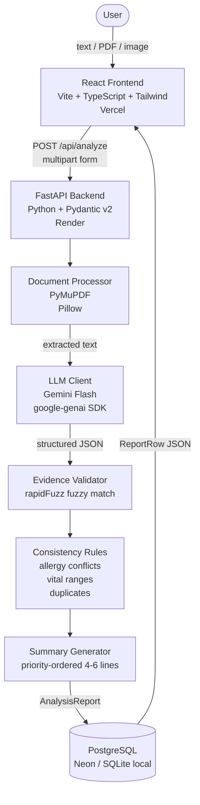

# Architecture

## System Overview



## Component Responsibilities

| Component | Location | Purpose |
|-----------|----------|---------|
| `AnalyzeForm` | `frontend/src/components/AnalyzeForm.tsx` | Text / file input with drag-and-drop |
| `ReportView` | `frontend/src/components/ReportView.tsx` | Collapsible report sections with evidence quotes |
| `HistoryPage` | `frontend/src/components/HistoryPage.tsx` | Report list + inline detail panel |
| `document_processor` | `backend/app/services/document_processor.py` | PDF text extraction, scanned-PDF→image fallback, image transcription |
| `llm_client` | `backend/app/services/llm_client.py` | Abstract `LLMClient` + Gemini implementation |
| `analyzer` | `backend/app/services/analyzer.py` | Pipeline orchestrator (extract → LLM → validate → rules → summarise) |
| `validators` | `backend/app/services/validators.py` | Evidence fuzzy-match hallucination guard |
| `consistency_rules` | `backend/app/services/consistency_rules.py` | Allergy/drug conflicts, implausible vitals, missing fields |

## Data Flow

```
User input
   │
   ▼
POST /api/analyze
   │
   ├─ text input ──────────────────────────────────┐
   │                                               │
   ├─ PDF ─→ PyMuPDF ─→ text                       │
   │             └─ no text? ─→ PyMuPDF pages ──  │
   │                              ─→ images ─→    │
   │                                Gemini Vision  │
   │                                (transcribe)   │
   │                                              │
   ├─ image ─→ Gemini Vision (transcribe) ────────┘
   │
   ▼
   extracted text (+ images for vision pass)
   │
   ▼
   GeminiClient.generate_json(system_prompt, user_prompt)
   │  └─ retry once on Pydantic validation failure
   │
   ▼
   AnalysisReport (Pydantic v2)
   │
   ├─ validate_evidence()    ← fuzzy match evidence quotes
   ├─ run_consistency_checks()  ← rule engine
   └─ _generate_summary()    ← LAST step, uses final arrays
   │
   ▼
   Report row saved to DB (status: completed | completed_with_warnings | failed)
   │
   ▼
   JSON response to frontend
```

## Status Lifecycle

Reports begin in `processing`. Successful analyses end as `completed`, or
`completed_with_warnings` when review items or consistency flags are present.
Documents that contain no clinical information end as `no_clinical_content`.
Pipeline or model failures end as `failed`.

## Deployment

| Service | Provider | Config |
|---------|----------|--------|
| Frontend | Vercel | Set `VITE_API_URL` to backend root URL |
| Backend | Render | Set env vars: `DATABASE_URL`, `GEMINI_API_KEY`, `MODEL_NAME`, `CORS_ORIGINS` |
| Database | Neon | PostgreSQL 16, connection pooling enabled |
