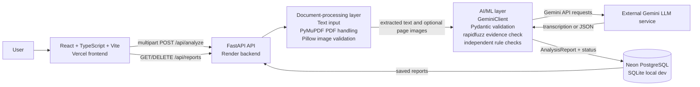

# Architecture

## System Diagram



The deployed topology uses Vercel for the frontend and Render for the backend. `DATABASE_URL` selects SQLite locally or PostgreSQL in a deployed environment; Neon is the documented PostgreSQL option. Gemini is an external service rather than a model hosted in this repository.

## Analyze Request Sequence

```mermaid
sequenceDiagram
    actor User
    participant Browser as React frontend
    participant API as FastAPI /api/analyze
    participant Processor as Document processor
    participant Gemini as External Gemini service
    participant Rules as Evidence + rule checks
    participant DB as SQLite or Neon PostgreSQL

    User->>Browser: Enter text or choose file
    Browser->>API: POST multipart text/file
    API->>DB: Insert report with status processing
    API->>Processor: Validate magic bytes and process input
    alt Plain text
        Processor-->>API: Source text
    else Searchable PDF
        Processor->>Processor: PyMuPDF extracts text >= 50 chars
        Processor-->>API: Source text
    else Image or scanned PDF
        Processor->>Processor: Pillow validates image or PyMuPDF renders PDF pages
        Processor->>Gemini: Vision transcription request
        Gemini-->>Processor: Transcribed text
        Processor-->>API: Text plus optional images
    end
    API->>Gemini: Structured extraction with schema and evidence prompt
    Gemini-->>API: JSON object
    API->>API: Pydantic validation; retry once with ValidationError if needed
    API->>Rules: Verify evidence and run consistency checks
    Rules-->>API: Review items, missing fields, inconsistency flags
    API->>API: Generate summary from final merged report
    API->>DB: Save report JSON and final status
    API-->>Browser: ReportDetail JSON
    Browser-->>User: Structured report and status
```

## Processing Boundaries

### Frontend

The React application contains the analysis form, report view, navigation, and history page. `src/api.ts` uses `fetch` and `VITE_API_URL`; Vite proxies `/api` to `http://127.0.0.1:8000` during local development. Vercel rewrites all paths to `index.html` so frontend refreshes work with the client-side page state.

### Backend API

FastAPI mounts three route modules:

- `GET /api/health` returns a lightweight health response.
- `POST /api/analyze` accepts either a text form field or one upload and runs the complete synchronous pipeline.
- `GET`, `GET /{id}`, and `DELETE /{id}` under `/api/reports` provide report history operations.

The API creates database tables during application startup. It uses dependency injection for database sessions and the LLM client, which lets tests replace both with deterministic fixtures.

### Document Processing

Text input is trimmed and passed through. Uploaded files are checked against allowed extensions, maximum size, and magic bytes. PyMuPDF extracts selectable PDF text and also renders PDF pages to PNG. A PDF with fewer than 50 extracted characters is treated as scanned and sent through vision. Pillow verifies standalone image files before vision processing.

### AI/ML and Safety Layers

`GeminiClient` sends text, optional images, a strict system prompt, and either a normal or JSON response configuration to the external Gemini API. The response is validated by Pydantic, then evidence and deterministic consistency checks run independently of the model. The analyzer generates the summary only after those mutations, so summary counts come from the final arrays.

### Persistence

The `Report` model stores status, input type, original filename, extracted text, report JSON, timestamps, and an error message. SQLAlchemy supports both the local SQLite URL and a PostgreSQL URL. There is no migration framework in this repository; startup uses `Base.metadata.create_all()`.

## Status Lifecycle

```text
processing
├── completed                  # no review items or inconsistency flags
├── completed_with_warnings    # review items or inconsistency flags exist
├── no_clinical_content        # report contains no meaningful clinical fields
└── failed                    # LLM, schema, file-processing, or pipeline error
```

Failed reports remain persisted with `status=failed` and a human-readable `error_message`. A no-content report receives a dedicated status and summary; consistency checks are skipped for it.

## Deployment Configuration

`render.yaml` defines a Render Python web service rooted at `backend`, using Python 3.12.0, `pip install -r requirements.txt`, and Uvicorn. It expects `DATABASE_URL`, `GEMINI_API_KEY`, and `CORS_ORIGINS` to be supplied by Render; the model is set to `gemini-3.5-flash-lite`. The frontend is built by Vercel from `frontend` and uses `VITE_API_URL` to reach the backend.
